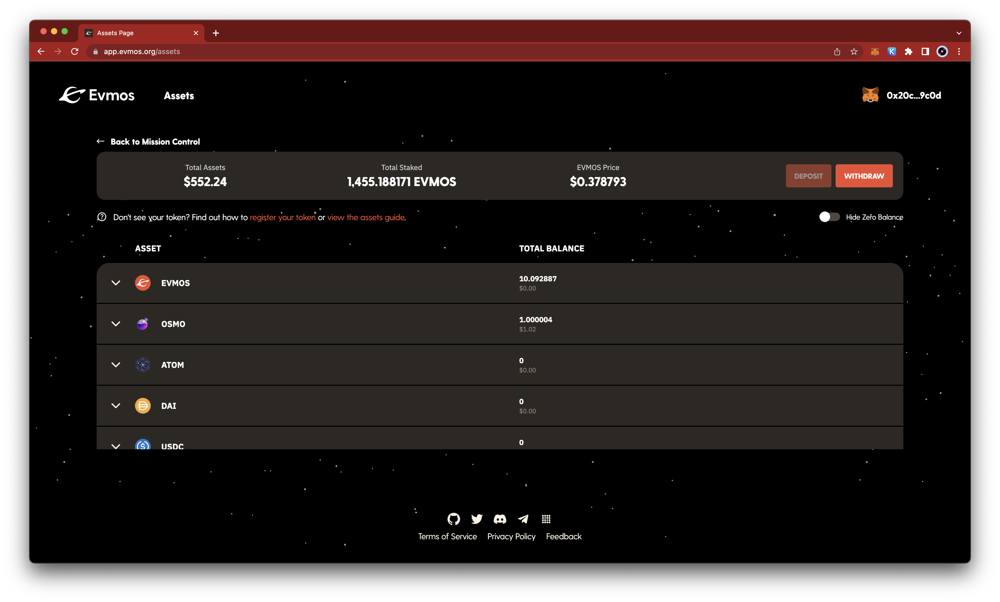

# Transfer Tokens

Once connected to the Openverse network, you can use your wallet to transfer tokens peer-to-peer without the need for a bank or an intermediary payment service. This gives you full ownership of your assets but also full responsibility for safekeeping your passwords.

Using either your wallet directly or connecting it to a dApp like the [Openverse Assets page](https://app.openverse.network/assets), gives you access to view your token balances, transfer tokens on the Openverse network, or deposit & withdraw tokens from & to other blockchain networks.

## View Balances

You can view the balances of all your crypto assets on Openverse, both the native $EVMOS token and assets that have been created on or sent to the Openverse network from other blockchains. The balance of an asset is described by the number of tokens and the equivalent value in $USD.

Like any other currency, crypto assets can be used as a storage of value or a medium of exchange. Only if an asset is traded on an exchange, its price can be determined by demand and supply against other assets. The native $EVMOS token provides additional utility on Openverse as it is used to secure the network through [staking](https://app.openverse.network/staking), vote on [governance](https://app.openverse.network/governance) proposals, and pay for gas.

On Openverse, assets can be represented as different types of tokens (e.g. Cosmos IBC Coins or EVM ERC20 tokens). We believe, however, that unless you are a developer, you don't need to be concerned with the underlying representation of a token. You just use the asset name and the Openverse network performs conversions between representations automatically.

## Onramp to Openverse

Onramping to Openverse (obtaining $EVMOS tokens) is required to start using Openverse as you need a small amount of "gas" to transfer assets or interact with dApps. This prevents users from spamming the network for free and paid gas is used to reward developers.

Here are some examples of how to onramp to Openverse:

* Use a decentralized exchange like Osmosis
* Ask a friend to transfer you $EVMOS
* Use services that allow you to exchange fiat currencies (e.g. $USD) for cryptocurrencies, (e.g. [C14](https://www.c14.money/buy))

## Send Assets on the same Chain

Sending and receiving Assets from one account on Openverse to another account on Openverse can be done directly through your wallet (e.g. Keplr/Metamask). To `send` assets you will have to provide the address of the receiving account, either in its Ethereum (e.g. `0x47EeB2eac350E1923b8CBDfA4396A077b36E62a0`) or Cosmos format (e.g. `openverse1glht96kr2rseywuvhhay894qw7ekuc4qg9z5nw`).

## Deposit and Withdraw Assets across Chains

Depositing assets from another blockchain to Openverse or withdrawing assets from Openverse to another blockchain is possible using the Openverse [Openverse Assets page](https://app.openverse.network/assets). This is useful, for example to onramp to Openverse or offramp Openverse into fiat currency.
